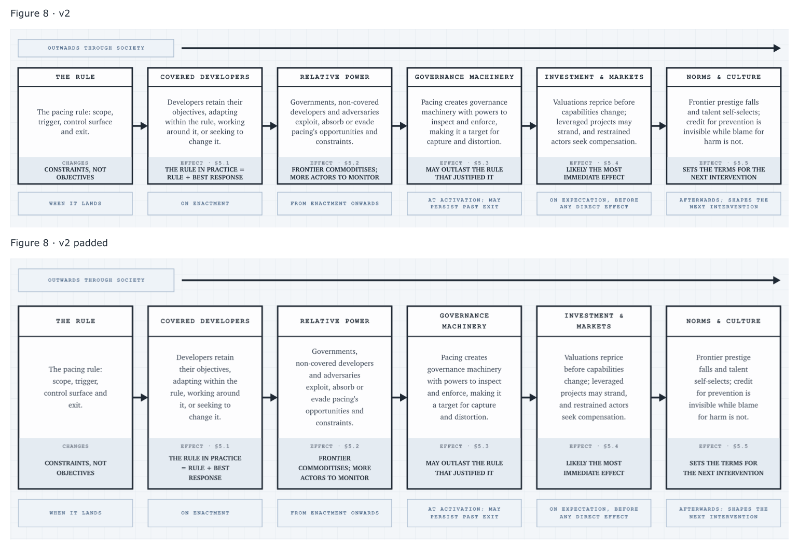
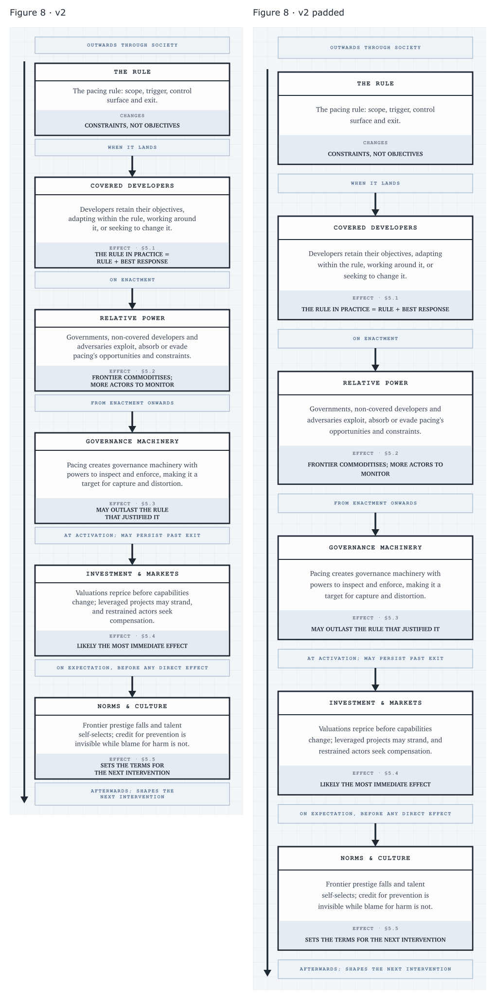
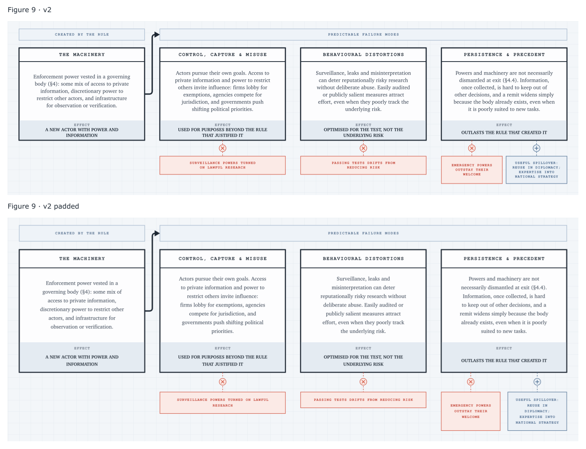
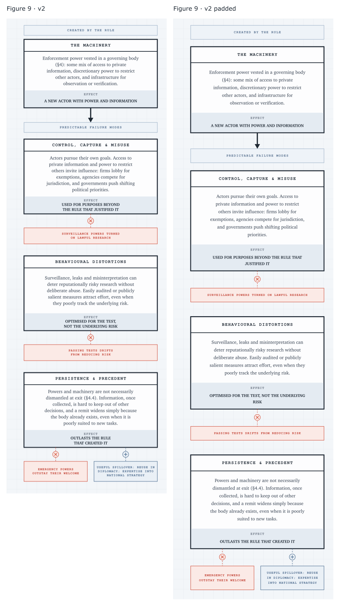

# Figures 8 and 9: v2 padded

The approved v2 copy and design, with larger internal padding, more line spacing, and taller boxes. The article uses these padded figures; unpadded v2s remain available for comparison.

Comparisons use equal widths: v2 above padded on desktop, v2 left of padded on mobile.

## Figure 8

### Desktop

[Padded SVG](../../public/media/then-what-v2-padded.svg)

### Mobile

[Padded SVG](../../public/media/then-what-v2-padded.mobile.svg)

## Figure 9

### Desktop

[Padded SVG](../../public/media/failure-modes-v2-padded.svg)

### Mobile

[Padded SVG](../../public/media/failure-modes-v2-padded.mobile.svg)

Regenerate: `python3 -B scripts/figures_v2_padded.py`. Add `--render-review` to render the comparison PNGs with Inkscape.
