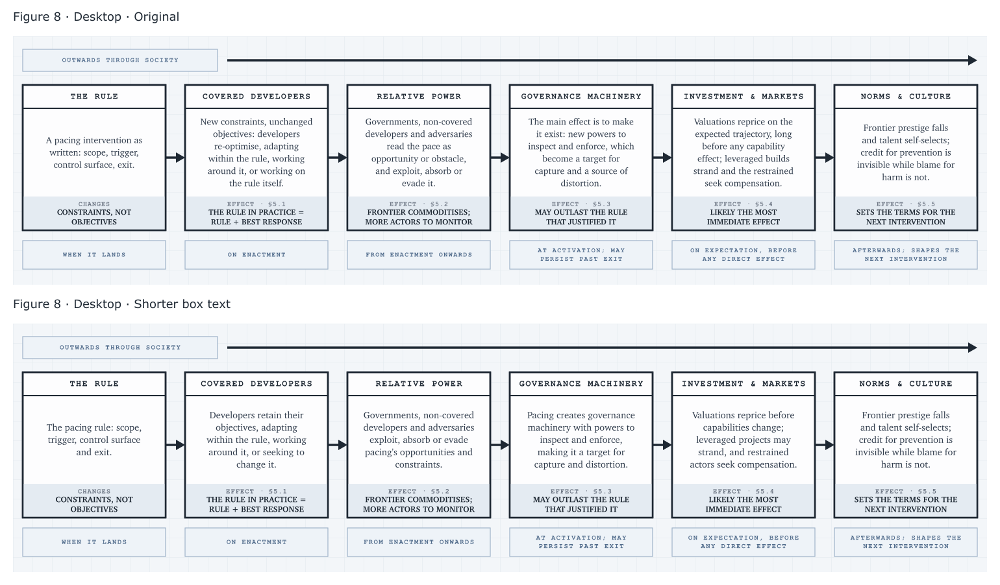
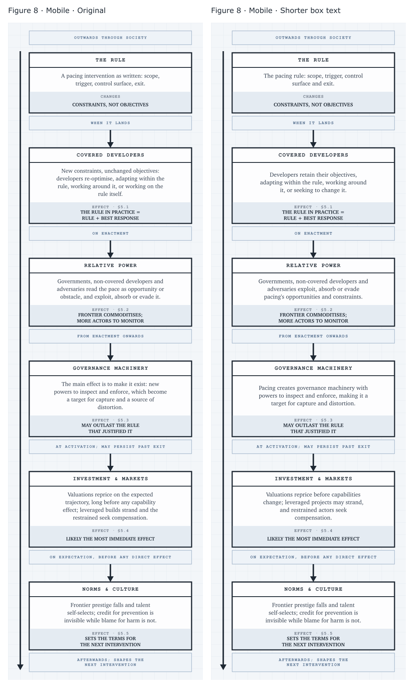
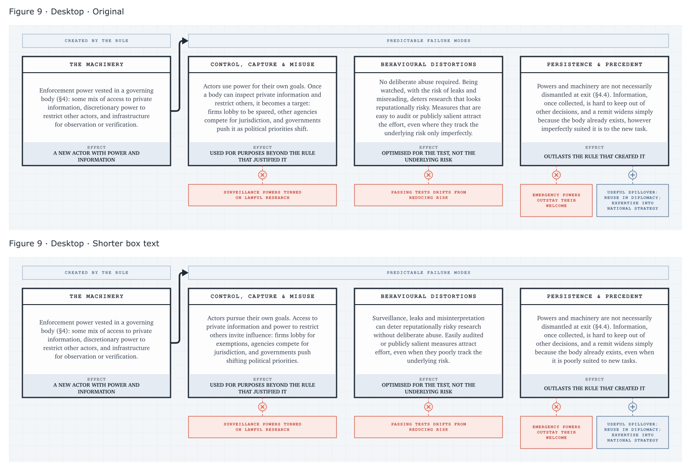
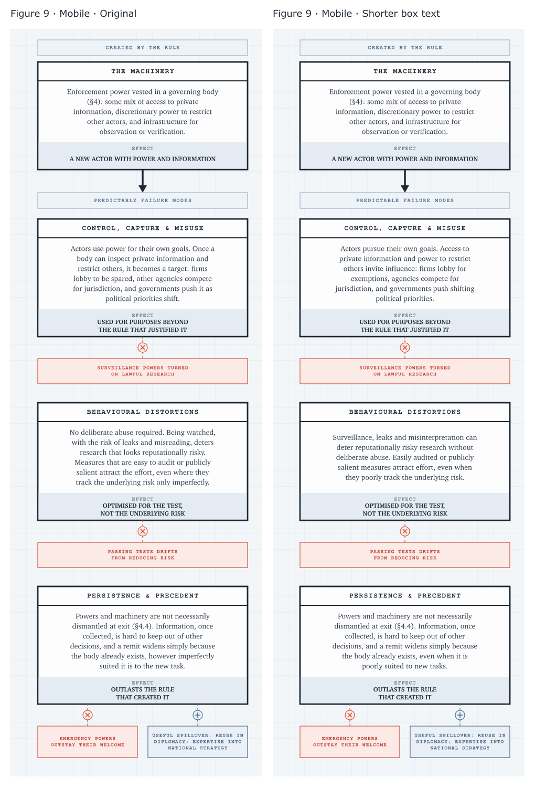

# Figures 8 and 9: comparison

Original figures alongside the v2 candidates. The article still uses the originals.
Desktop pairs are stacked; mobile pairs are side by side, with the original on the left.
Each pair uses equal display widths. Open an image to view it at full size.

## Figure 8

[Desktop SVG](../../public/media/then-what-v2.svg) · [Mobile SVG](../../public/media/then-what-v2.mobile.svg)

### Desktop

### Mobile

## Figure 9

[Desktop SVG](../../public/media/failure-modes-v2.svg) · [Mobile SVG](../../public/media/failure-modes-v2.mobile.svg)

### Desktop

### Mobile

Generate the candidate SVGs with `python3 -B scripts/figures_v2.py` from the repository root.
The comparison PNGs show these candidates against the originals.
